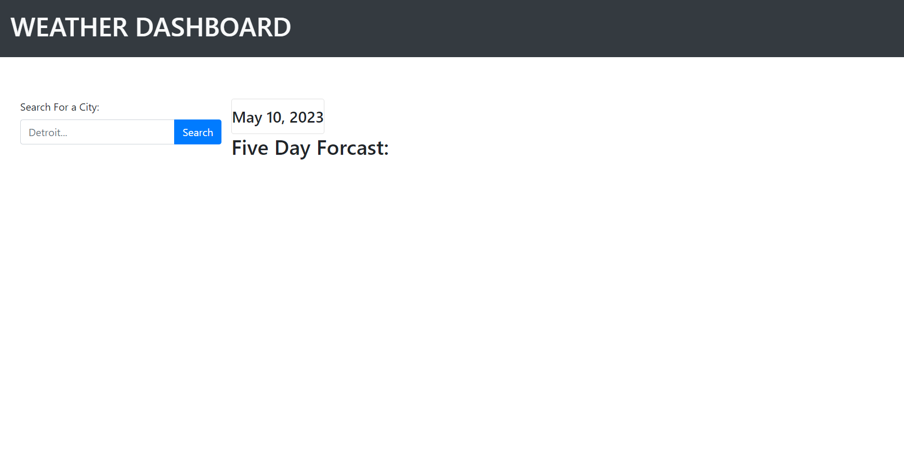
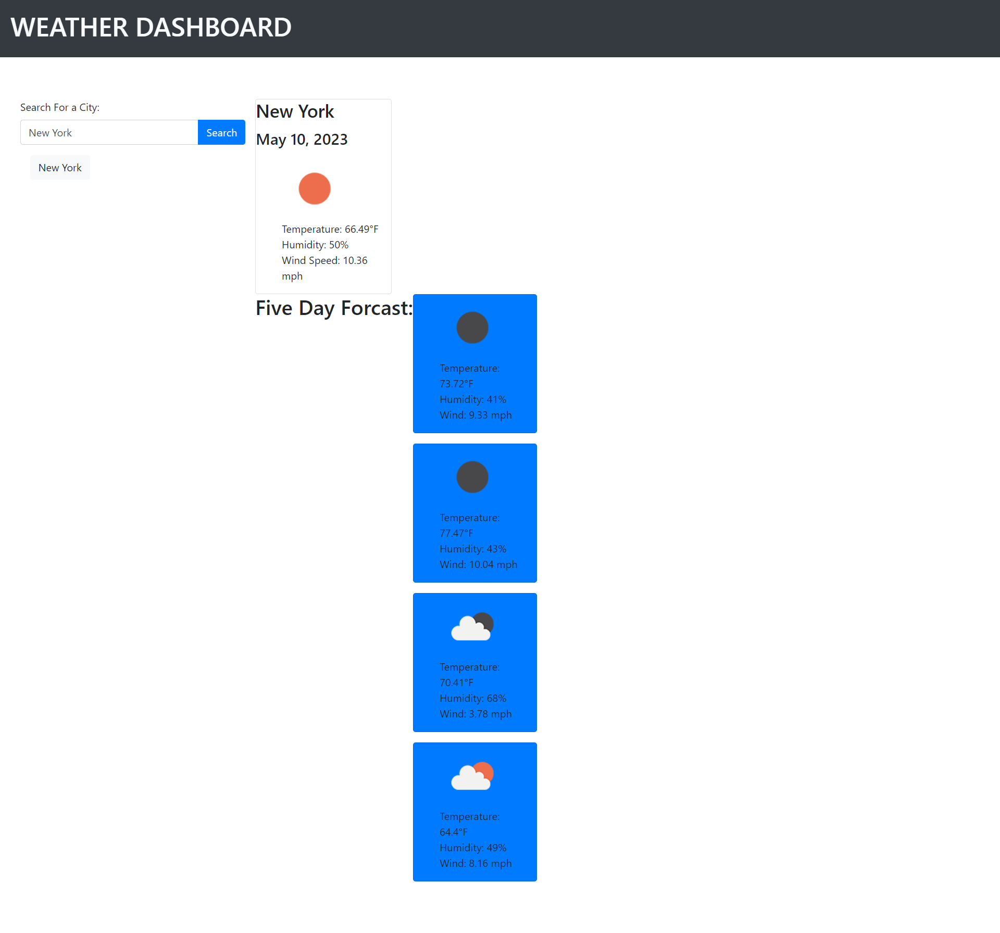

# WEATHER DASHBOARD

## Description
The purpose of this application is to allow a user to search the weather for any given city in the US. When the user enters the name of a city, they are presented with the current weather as well as a five day forecast. The user's search history is saved and presented on the screen as well in the case that they would like to revisit a particular city's weather data. The application utlizes third party APIs, localStorage, Bootstrap, JQuery and DayJS.  

## Installation

## Usage
Links:
- [Link to deployed site](https://sydlaub.github.io/weather-dashboard/)
- [Link to github repository](https://github.com/sydlaub/weather-dashboard)

The website can be viewed on a desktop web browser as shown below

## Credits
Collaborators include teachers, TAs, tutors and fellow students in the Columbia University Full Stack Engineering Bootcamp 2023 Spring cohort.
NOTE: This application starter code was provided by the Columbia University School of Engineering.  